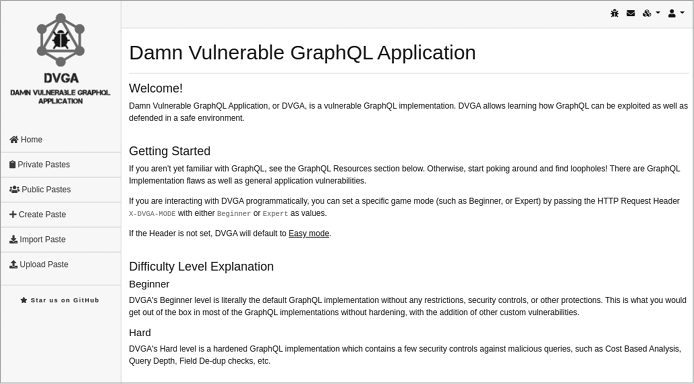

# Setting Up a Vulnerable GraphQL Server

## **Installing Docker**

Docker is a tool for managing containers, which package software and its dependencies to run in any environment. It's available for Windows, macOS, and Linux. To begin, install Docker on your system:

1.  Install Docker via Kali repositories:

    ```bash
    sudo apt install -y docker.io
    ```
2.  Enable Docker to start automatically on reboot:

    ```bash
    sudo systemctl enable docker --now
    ```
3.  Verify Docker installation:

    ```bash
    sudo docker
    ```

## **Deploying the Damn Vulnerable GraphQL Application (DVGA)**

The DVGA simulates vulnerabilities like DoS attacks, SQL injection, broken authorization, and more, making it ideal for security testing. It’s open source and available on GitHub [here](https://github.com/dolevf/Damn-Vulnerable-GraphQL-Application).

To set it up:

1.  Install Git:

    ```bash
    sudo apt install git -y
    ```
2.  Clone the DVGA repository:

    ```bash
    git clone -b blackhatgraphql https://github.com/dolevf/Damn-Vulnerable-GraphQL-Application.git
    cd Damn-Vulnerable-GraphQL-Application
    ```
3.  Build the Docker image for DVGA:

    ```bash
    sudo docker build -t dvga .
    ```
4.  Run the DVGA container:

    ```bash
    sudo docker run -t --rm -d --name dvga -p 5013:5013 -e WEB_HOST=0.0.0.0 dvga
    ```
5.  Verify the container is running:

    ```bash
    sudo docker container ps
    ```

## **Accessing the Application**

<figure><figcaption></figcaption></figure>

Once the container is up and running, you can access DVGA by opening a web browser and visiting `http://localhost:5013`. The interface resembles a service like Pastebin, where users can share text snippets called "pastes". Each paste has metadata such as title, content, and author information, which can be used for testing GraphQL queries.

**Testing the Server with a GraphQL Query**

Finally, confirm the server’s functionality using the Altair GraphQL client. In the client, set the URL to `http://localhost:5013/graphql` and run the following query:

```graphql
query {
  systemHealth
}
```

The response should indicate the system’s health status, confirming that the DVGA server is accessible and ready for further testing.
