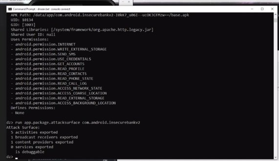

# Java JDK, JRE and JVM

* **JVM (Java Virtual Machine)** is an abstract machine that enables your computer to run a Java program.

<figure><figcaption></figcaption></figure>

* **JRE (Java Runtime Environment)** is a software package that provides Java class libraries, Java Virtual Machine (JVM), and other components that are required to run Java applications.
* **JDK (Java Development Kit)** is a software development kit required to develop applications in Java. When you download JDK, JRE is also downloaded with it.

### What is JDK? 

JDK (Java Development Kit) is a software development kit required to develop applications in Java. When you download JDK, JRE is also downloaded with it.

In addition to JRE, JDK also contains a number of development tools (compilers, JavaDoc, Java Debugger, etc).

<figure><figcaption>
Java Development Kit
</figcaption></figure>

If you want to develop Java applications, [download JDK](http://www.oracle.com/technetwork/java/javase/downloads/index-jsp-138363.html).

***

### Relationship between JVM, JRE, and JDK.

<figure><figcaption>
Relationship between JVM, JRE, and JDK
</figcaption></figure>
