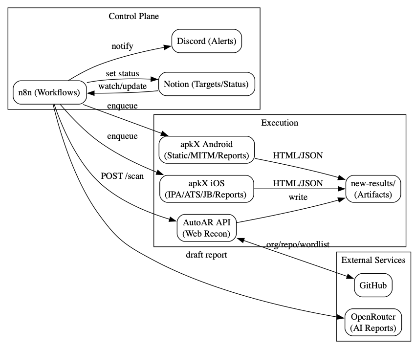

# Prototype Pollution

## Understanding JavaScript Prototype Pollution

### **JavaScript Prototypes and Inheritance**

JavaScript uses a prototypal inheritance model, which differs from the class-based inheritance seen in many other programming languages. In this model, every object in JavaScript is linked to a prototype, which is essentially another object from which it inherits properties and methods. Understanding this concept is crucial for grasping how prototype pollution vulnerabilities arise.

### **What is an Object in JavaScript?**

In JavaScript, an object is a collection of key-value pairs, known as properties. For example, consider the following object representing a user:

```javascript
const user =  {
    username: "wiener",
    userId: 01234,
    isAdmin: false
}
```

You can access the properties of an object using dot notation or bracket notation:

```javascript
user.username     // "wiener"
user['userId']    // 01234
```

These properties can include data or executable functions, referred to as methods.

### **What is a Prototype in JavaScript?**

Every JavaScript object is associated with another object known as its prototype. By default, JavaScript assigns new objects a built-in prototype, such as `Object.prototype`, `String.prototype`, or `Array.prototype`. These prototypes provide useful properties and methods that the object can inherit.

For example:

```javascript
let myString = "";
Object.getPrototypeOf(myString);    // String.prototype
```

### **How Does Object Inheritance Work in JavaScript?**

When you reference a property of an object, the JavaScript engine first checks the object itself. If the property doesn’t exist, it then checks the object’s prototype, and if necessary, continues up the prototype chain until it reaches `Object.prototype`.

For instance:

```javascript
let myObject = {};
console.log(myObject.toString());   // Inherited from Object.prototype
```

The prototype chain allows objects to inherit properties and methods from other objects, creating a hierarchy of inheritance.

<figure><figcaption></figcaption></figure>

### **Modifying Prototypes**

In JavaScript, it's possible to modify built-in prototypes, although this is generally considered bad practice. Modifying prototypes allows developers to customize or override the behavior of built-in methods, which can have widespread effects across all objects that inherit from that prototype.

For example, adding a custom method to `String.prototype`:

```javascript
String.prototype.removeWhitespace = function(){
    return this.trim();
}
```

## **What is Prototype Pollution?**

Prototype pollution is a JavaScript vulnerability that allows an attacker to add or modify properties on global object prototypes, which are then inherited by other objects. This can lead to various security issues, such as executing arbitrary code or altering the behavior of applications.

### **How Do Prototype Pollution Vulnerabilities Arise?**

Prototype pollution typically occurs when an application merges user-controllable objects into an existing object without properly sanitizing the keys. This can allow an attacker to inject properties like `__proto__`, leading to the pollution of the prototype.

For example, if a URL or JSON input allows an attacker to inject `__proto__`, it might be merged into the target object, leading to:

```javascript
targetObject.__proto__.evilProperty = 'payload';
```

As a result, the `evilProperty` is added to the prototype, affecting all objects that inherit from it.

### **Prototype Pollution Sources**

Common sources of prototype pollution include:

* **URL parameters**: An attacker can inject `__proto__` via the query string in a URL.
* **JSON input**: Malicious JSON can contain `__proto__` keys, which when parsed, lead to prototype pollution.
* Web messages

### **Prototype Pollution Sinks**

A sink is a JavaScript function or DOM element that can execute the malicious properties injected through prototype pollution. For example, if an application uses polluted properties without proper validation, it can lead to vulnerabilities like DOM XSS or even server-side code execution.

### **Prototype Pollution Gadgets**

A gadget is a property that an attacker can control via prototype pollution to execute malicious actions. For example, a library might use a configuration object where an attacker could inject a malicious URL:

```javascript
let transport_url = config.transport_url || defaults.transport_url;
```

If an attacker controls `transport_url` through prototype pollution, they could force the application to load a malicious script.

## Resources



