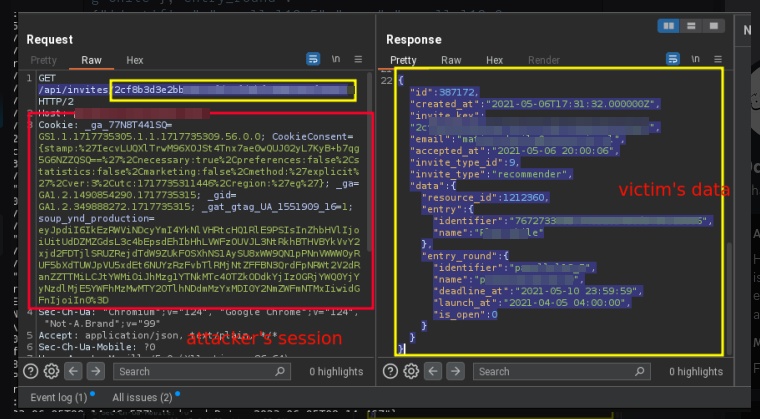

# The Power Of IDOR even if it is unpredictable IDs

### **Introduction**

Participating in private bug bounty programs can be both thrilling and rewarding. Recently, we had the opportunity to take part in a private bug bounty program on HackerOne. The scope was limited to the main application, and within this constrained environment, we managed to uncover two high-severity vulnerabilities. Here's a detailed account of our findings and the impact they had.

### Insecure Direct Object Reference (IDOR) Discloses user's Emails and IDs and other sesetive informations

**Overview**

Our first significant finding was an Insecure Direct Object Reference (IDOR) vulnerability in one of the API endpoints. This type of vulnerability occurs when an application exposes internal objects to users without proper access control, allowing attackers to manipulate the reference and access unauthorized data.

**Vulnerable Endpoint**

The endpoint in question was responsible for handling invitations:

```http
GET /api/invites/{Invite-ID} HTTP/2
Host: platform.example.com
Cookie: <your-cookie>
User-Agent: Mozilla/5.0 (X11; Linux x86_64) AppleWebKit/537.36 (KHTML, like Gecko) Chrome/124.0.0.0 Safari/537.36
```

By manipulating the `Invite-ID` parameter, we could access invitation details of other users, revealing sensitive information such as email addresses, user IDs, and detailed application information.

**Steps to Reproduce**

1. **Log in** to the application.
2. **Intercept the request** to `/api/invites/{Invite-ID}`.
3. **Change the `Invite-ID`** to another valid ID.
4. **Observe the response** containing sensitive information of other users.

**Proof of Concept**

A crafted request to the vulnerable endpoint returned the following sensitive data:

```json
{
    "id": 387172,
    "created_at": "2021-05-06T17:31:32.000000Z",
    "invite_key": "2cf8██████████████████82432fc83e7",
    "email": "example@example.com",
    "accepted_at": "2021-05-06 20:00:06",
    "invite_type": "recommender",
    "data": {
        "resource_id": 1212360,
        "entry": {
            "identifier": "767273███████████████████████████25836",
            "name": "Example Project"
        }
    }
}
```

<figure><figcaption></figcaption></figure>

### **Additional Findings**

While investigating, we discovered that some of the invite IDs were still valid and could be used by attackers to gain unauthorized access to organizations. **`These invite IDs were found on public archives, such as the Wayback Machine`**, making them easily accessible to malicious actors.

<figure><figcaption></figcaption></figure>

**Impact**

The vulnerability exposed sensitive information, including user email addresses and detailed project data, which could lead to privacy violations and unauthorized access to user accounts. The discovery of valid invite IDs in public archives further exacerbates the risk, as attackers could leverage these to gain access and infiltrate organizations.

### Privilege Escalation in Member Management API

**Overview**

Our second major finding was a privilege escalation vulnerability in the member management API. This allowed non-team-leader users to access team management details, leading to potential misuse and unauthorized access.

**Vulnerable Endpoint**

The vulnerable endpoint was responsible for fetching member details:

```http
GET /api/entries/{entry_id}/members HTTP/2
Host: platform.example.com
Cookie: <Non-Team-Leader-Member's-Cookie>
User-Agent: Mozilla/5.0 (Windows NT 10.0; Win64; x64) AppleWebKit/537.36 (KHTML, like Gecko) Chrome/121.0.6167.160 Safari/537.36
```

**Steps to Reproduce**

1. **Login** as a non-team-leader member.
2. **Send an API request** to the endpoint with a valid entry ID.
3. **Observe the response** containing sensitive team management details.

**Proof of Concept**

The API response included sensitive information such as invitation keys and email addresses of unaccepted invitations:

```json
[
    {
        "id": ███████,
        "entry_id": ███████,
        "member_type_id": 2,
        "invitation_id": ███████,
        "invite": {
            "id": 449254,
            "invite_key": "f1d6c5884███████████████████████████f5e5735",
            "email": "example@example.com"
        }
    }
]
```

**Impact**

This vulnerability allowed unauthorized users to retrieve and potentially use invitation keys to claim invitations, leading to unauthorized access to team data and operations and impersonating the victim's by claiming their accounts.

**Conclusion**

Finding and reporting these high-impact vulnerabilities highlighted the importance of thorough testing and the value of private bug bounty programs. By identifying and responsibly disclosing these issues, we helped enhance the security of the application and protected sensitive user information.

Participating in this program was a valuable experience, underscoring the critical role of security researchers in safeguarding digital platforms. If you're a fellow bug hunter or just getting started, remember that even within limited scopes, there's always potential to uncover significant vulnerabilities. Happy hunting!

***

_Note: Specific details and sensitive information have been redacted to protect the confidentiality of the program and its users._
